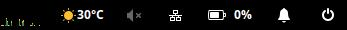

# Wingpanel Weather Indicator




## Building from code

It's recommended to create a clean build environment

    mkdir build
    cd build/

Run `cmake` to configure the build environment and then `make` to build

    cmake -DCMAKE_INSTALL_PREFIX=/usr ..
    make

To install, use `make install`

    sudo make install


## Installation

Download prebuild binairy from [Release](https://github.com/kunalkushwaha/wingpanel-indicator-weather/releases)

Install it by coping file to wingpanel plugin folder as below.

```
sudo cp libweather.so /usr/lib/x86_64-linux-gnu/wingpanel/libweather.so

pkill -9 wingpanel
```

### NOTE: 

Get secret key from [darksky.net](https://darksky.net/dev/account) and store it in your config file.

    cat ~/.weather.config
    {
        "key":"XXXXXXXXXXXXXXXXXXXX"
    }
